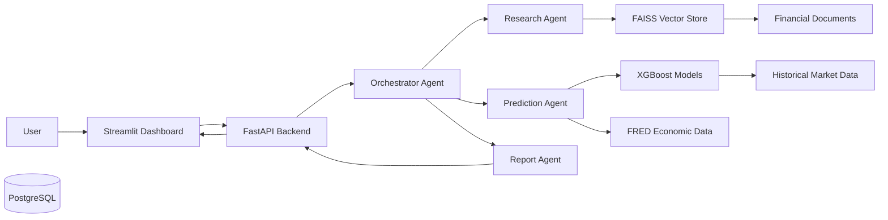
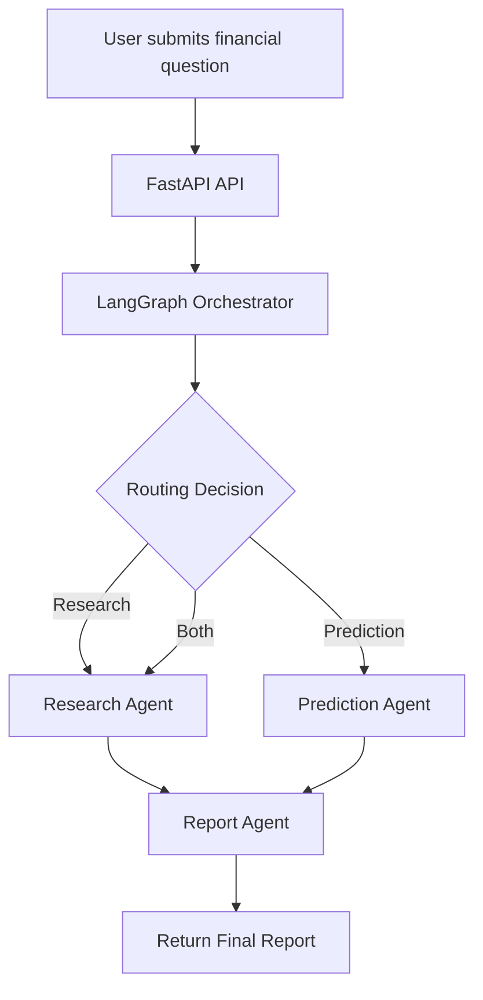
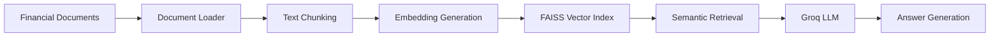
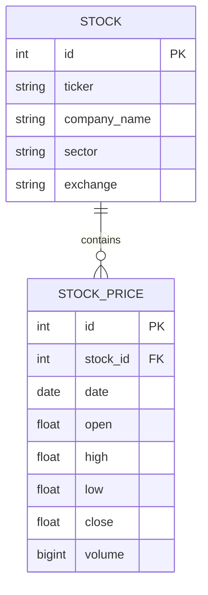

# 📈 FinSight AI

> **Production-Grade Multi-Agent Financial Intelligence Platform**

FinSight AI is an autonomous, production-grade financial intelligence platform that combines **Multi-Agent AI**, **Retrieval-Augmented Generation (RAG)**, **Machine Learning**, and **Financial Data Engineering** to analyse financial markets, retrieve insights from corporate filings, forecast stock movements, and generate analyst-style financial reports.

The platform is designed to simulate the workflow of a financial analyst by orchestrating multiple specialised AI agents that collaborate to answer complex financial questions using both structured and unstructured financial data.

---

## Project Highlights

- 🤖 Multi-Agent Architecture using **LangGraph**
- 📚 Retrieval-Augmented Generation (RAG) over financial documents
- 📈 Machine Learning stock prediction using **XGBoost**
- 🏦 Financial data storage with **PostgreSQL**
- 🌍 Macroeconomic data integration using **FRED API**
- 📊 Interactive dashboard built with **Streamlit**
- ⚡ RESTful API built with **FastAPI**
- 🔍 Semantic document search using **FAISS Vector Database**
- 🐳 Fully Dockerized development environment
- 🧩 Modular and scalable project architecture
- 📄 AI-generated financial research reports

---

## Problem Statement

Financial analysis often requires gathering information from multiple sources including historical market data, company filings, macroeconomic indicators, and technical indicators. This process is time-consuming and requires significant manual effort.

FinSight AI automates this workflow by combining specialised AI agents capable of retrieving, analysing, forecasting, and summarising financial information into a single intelligent platform.

Rather than relying on a single Large Language Model, the platform orchestrates multiple specialised agents that collaborate to produce accurate, explainable, and structured financial insights.

# Table of Contents

- [Architecture](#architecture)
- [System Workflow](#system-workflow)
- [Key Features](#key-features)
- [Technology Stack](#technology-stack)
- [Project Structure](#project-structure)
- [Multi-Agent Architecture](#multi-agent-architecture)
- [Machine Learning Pipeline](#machine-learning-pipeline)
- [Retrieval-Augmented Generation (RAG)](#retrieval-augmented-generation-rag)
- [Database Design](#database-design)
- [REST API](#rest-api)
- [Installation](#installation)
- [Configuration](#configuration)
- [Running the Project](#running-the-project)
- [Docker Deployment](#docker-deployment)
- [Future Roadmap](#future-roadmap)
- [License](#license)

---

# Key Features

## Multi-Agent Financial Intelligence

The platform uses multiple specialised AI agents coordinated through **LangGraph**. Each agent is responsible for a specific financial analysis task, allowing the system to reason, retrieve information, generate predictions, and produce structured reports collaboratively.

---

## Retrieval-Augmented Generation (RAG)

The research agent performs semantic document retrieval over indexed financial documents using **FAISS** before generating responses with a Large Language Model. This significantly improves factual accuracy by grounding responses in real financial documents.

Current document support includes:

- SEC 10-K Reports
- Federal Reserve Monetary Policy Reports
- FOMC Meeting Minutes

---

## Machine Learning Stock Prediction

The prediction agent uses an **XGBoost** classifier trained on historical market data and technical indicators to estimate the probability of next-day stock price movement.

Current supported companies include:

- Apple (AAPL)
- Microsoft (MSFT)
- NVIDIA (NVDA)
- Amazon (AMZN)
- Alphabet (GOOGL)
- Meta (META)
- Tesla (TSLA)

Each prediction includes:

- Predicted market direction
- Confidence score
- Feature importance analysis

---

## Financial Dashboard

The Streamlit dashboard provides an interactive interface for exploring financial data and AI-generated insights.

Current dashboard capabilities include:

- Company selection
- Historical candlestick charts
- Trading volume visualisation
- Stock prediction summary
- AI-generated financial research
- Confidence metrics

---

## Macroeconomic Analysis

The platform incorporates macroeconomic indicators obtained from the Federal Reserve Economic Data (FRED) API.

Examples include:

- CPI
- Interest Rates
- Unemployment Rate
- GDP
- Inflation Indicators

These indicators are incorporated into the machine learning feature engineering pipeline to improve prediction performance.

---

## Production-Oriented Architecture

FinSight AI has been designed using modular software engineering principles.

Key characteristics include:

- Modular agent architecture
- RESTful FastAPI backend
- PostgreSQL persistence layer
- SQLAlchemy ORM
- Dockerised development environment
- Configuration-driven ticker management
- Scalable project structure

# Architecture

FinSight AI follows a modular, agent-based architecture where multiple specialised AI agents collaborate to answer financial questions and generate analyst-style reports.

The platform separates responsibilities into independent components responsible for data ingestion, machine learning, document retrieval, orchestration, and presentation.



---

# System Workflow

The following workflow illustrates how a user request is processed through the FinSight AI platform.



---

# Multi-Agent Architecture

FinSight AI adopts an autonomous multi-agent design in which each agent performs a specialised task.

| Agent | Responsibility |
|---------|----------------|
| **Orchestrator Agent** | Determines which specialised agents should execute for a user request. |
| **Research Agent** | Retrieves relevant financial information using Retrieval-Augmented Generation (RAG). |
| **Prediction Agent** | Generates stock movement predictions using trained XGBoost models. |
| **Report Agent** | Combines outputs from multiple agents into a structured financial report. |

The orchestration layer is implemented using **LangGraph**, enabling conditional execution paths depending on the user's query.

For example:

- Research-only questions invoke the Research Agent.
- Prediction-only questions invoke the Prediction Agent.
- Complex financial questions invoke both agents before generating the final report.

# Technology Stack

## Programming Languages

- Python 3.12
- SQL

---

## Backend

- FastAPI
- SQLAlchemy
- Pydantic
- Uvicorn

---

## Artificial Intelligence

- LangGraph
- LangChain
- Groq LLM
- Retrieval-Augmented Generation (RAG)

---

## Machine Learning

- XGBoost
- Scikit-learn
- Pandas
- NumPy

---

## Vector Search

- FAISS
- Sentence Transformers
- Hugging Face Embeddings

---

## Database

- PostgreSQL

---

## Financial Data

- Yahoo Finance
- Federal Reserve Economic Data (FRED)

---

## Frontend

- Streamlit
- Plotly

---

## DevOps

- Docker
- Docker Compose

---

## Version Control

- Git
- GitHub

---

# Project Structure

```
finsight-ai
│
├── agents/
│   ├── ml_prediction_agent/
│   ├── orchestrator_agent/
│   ├── research_agent/
│   └── report_agent/
│
├── api/
│   ├── database/
│   ├── models/
│   └── main.py
│
├── config/
│
├── data/
│   ├── raw/
│   └── processed/
│
├── docs/
│
├── notebooks/
│
├── rag/
│   ├── embeddings/
│   ├── ingestion/
│   ├── qa/
│   ├── retrieval/
│   └── vectorstore/
│
├── scripts/
│
├── tests/
│
├── ui/
│
├── docker-compose.yml
├── Dockerfile
├── requirements.txt
├── startup.py
├── README.md
└── LICENSE
```

---

# Project Modules

### `agents/`

Contains all AI agents responsible for specialised financial tasks.

- Orchestrator Agent
- Research Agent
- Prediction Agent
- Report Agent

---

### `api/`

Implements the FastAPI backend, REST API endpoints, SQLAlchemy models, and database connectivity.

---

### `rag/`

Implements the complete Retrieval-Augmented Generation pipeline, including:

- Document ingestion
- Text chunking
- Embedding generation
- FAISS indexing
- Semantic retrieval
- Question answering

---

### `ui/`

Contains the Streamlit application responsible for visualising stock data, predictions, charts, and AI-generated reports.

---

### `scripts/`

Utility scripts used for:

- Downloading market data
- Training machine learning models
- Loading historical prices
- Building vector indexes
- Database initialisation

---

### `config/`

Stores project-wide configuration, including supported stock tickers and environment-specific settings.

---

### `tests/`

Contains development and debugging scripts used during implementation and validation.

# Machine Learning Pipeline

The Prediction Agent uses a supervised machine learning pipeline to forecast the next-day stock price direction for supported companies.

The pipeline was designed to be modular, allowing new companies to be added with minimal configuration changes.

## Data Collection

Historical market data is collected using the Yahoo Finance API.

Each dataset includes:

- Open Price
- High Price
- Low Price
- Close Price
- Volume

Macroeconomic indicators are simultaneously collected from the Federal Reserve Economic Data (FRED) API.

Current indicators include:

- Consumer Price Index (CPI)
- Unemployment Rate
- Federal Funds Rate

---

## Feature Engineering

The feature engineering pipeline generates technical indicators used for prediction.

Current features include:

### Market Features

- Open
- High
- Low
- Close
- Volume

### Technical Indicators

- SMA (20)
- SMA (50)
- RSI
- MACD
- MACD Signal
- Daily Returns
- Volatility

### Macroeconomic Features

- CPI
- Unemployment Rate
- Interest Rate

---

## Model Training

Each supported stock has its own independently trained XGBoost classifier.

Training includes:

- Time-aware feature generation
- Missing value handling
- Target generation
- Cross-validation
- Feature importance evaluation

The trained models are stored as serialized artefacts and loaded dynamically by the Prediction Agent during inference.

---

## Prediction Output

For each prediction the API returns:

- Stock ticker
- Predicted direction (UP / DOWN)
- Probability of upward movement
- Probability of downward movement

The Streamlit dashboard visualises these predictions together with confidence scores.

---

# Retrieval-Augmented Generation (RAG)

FinSight AI uses Retrieval-Augmented Generation to answer financial questions using information extracted from financial documents instead of relying solely on Large Language Models.

This significantly improves factual accuracy while reducing hallucinations.

---

## Document Processing Pipeline

The RAG pipeline consists of the following stages:



---

## Current Document Sources

The indexed knowledge base currently contains:

- SEC 10-K Annual Reports
- Federal Reserve Reports
- FOMC Meeting Minutes

The architecture is designed to support additional financial document sources without modifying the retrieval pipeline.

---

## Retrieval Workflow

For each user query the Research Agent performs the following sequence:

1. Rewrite the user's question for improved retrieval.
2. Generate semantic embeddings.
3. Search the FAISS vector database.
4. Retrieve the most relevant document chunks.
5. Construct an evidence-based prompt.
6. Generate the final answer using Groq LLM.
7. Return the answer together with document references.

This workflow enables grounded responses based on indexed financial documents rather than model memory.

---

# Database Design

FinSight AI uses PostgreSQL as the primary relational database.

The database stores:

- Supported companies
- Historical stock prices
- Financial metadata

---

## Database Schema



---

## Current Database Tables

### Stocks

Stores metadata for each supported company.

Examples:

- Apple
- Microsoft
- NVIDIA
- Amazon
- Alphabet
- Meta
- Tesla

---

### Stock Prices

Stores historical OHLCV market data for each company.

Each record contains:

- Trading Date
- Open Price
- High Price
- Low Price
- Close Price
- Trading Volume

The prediction pipeline retrieves data directly from PostgreSQL, ensuring a consistent data source for both model training and inference.

# REST API

FinSight AI exposes a RESTful API built with FastAPI for integrating the AI agents, machine learning models, and financial data services.

---

## Available Endpoints

| Method | Endpoint | Description |
|----------|----------|-------------|
| GET | `/` | API status |
| GET | `/health` | Health check |
| GET | `/ready` | Readiness check |
| POST | `/ask` | Query the Multi-Agent AI system |
| GET | `/predict/{ticker}` | Predict next-day stock movement |
| GET | `/stocks/{ticker}/history` | Retrieve historical stock prices |

---

## Example Request

### Ask FinSight AI

```http
POST /ask
```

```json
{
    "query": "Should I invest in Apple based on current market conditions?"
}
```

---

### Example Response

```json
{
    "query": "Should I invest in Apple based on current market conditions?",
    "report": "..."
}
```

---

### Stock Prediction

```http
GET /predict/AAPL
```

Example response:

```json
{
    "ticker": "AAPL",
    "prediction": "UP",
    "confidence_up": 71.82,
    "confidence_down": 28.18
}
```

---

### Historical Prices

```http
GET /stocks/AAPL/history
```

Returns historical OHLCV data used by the dashboard.

---

# Installation

## Clone the Repository

```bash
git clone https://github.com/<your-github-username>/finsight-ai.git

cd finsight-ai
```

---

## Create Virtual Environment

```bash
python -m venv venv
```

Windows

```bash
venv\Scripts\activate
```

Linux / macOS

```bash
source venv/bin/activate
```

---

## Install Dependencies

```bash
pip install -r requirements.txt
```

---

# Configuration

Create a `.env` file in the project root.

```env
DB_USER=
DB_PASSWORD=
DB_HOST=
DB_PORT=
DB_NAME=

GROQ_API_KEY=
FRED_API_KEY=

GROQ_MODEL=
FASTAPI_URL=
```

---

# Running the Project

## Start Docker

```bash
docker compose up --build
```

---

## Run the Streamlit Dashboard

```bash
streamlit run ui/app.py
```

---

## API Documentation

FastAPI automatically generates interactive API documentation.

Swagger UI

```
http://localhost:8000/docs
```

OpenAPI JSON

```
http://localhost:8000/openapi.json
```

---

# Docker Deployment

The project is fully containerised using Docker and Docker Compose.

The Docker environment includes:

- FastAPI Backend
- PostgreSQL Database
- Streamlit Dashboard

Run the complete application using:

```bash
docker compose up --build
```

Stop the application:

```bash
docker compose down
```

Rebuild containers:

```bash
docker compose up --build --force-recreate
```

# Version 1 Achievements

FinSight AI Version 1 successfully delivers an end-to-end financial intelligence platform capable of combining machine learning, financial data engineering, Retrieval-Augmented Generation (RAG), and Multi-Agent AI into a single modular system.

## Completed Features

- ✅ Multi-Agent Architecture using LangGraph
- ✅ FastAPI REST API
- ✅ Streamlit Interactive Dashboard
- ✅ PostgreSQL Database Integration
- ✅ Retrieval-Augmented Generation (RAG)
- ✅ FAISS Vector Database
- ✅ Financial Document Semantic Search
- ✅ Question Rewriting Pipeline
- ✅ Groq-powered AI Research Agent
- ✅ XGBoost Stock Prediction Models
- ✅ Technical Indicator Feature Engineering
- ✅ FRED Macroeconomic Data Integration
- ✅ Historical Stock Data Pipeline
- ✅ Configuration-driven Multi-Ticker Support
- ✅ Dockerized Development Environment
- ✅ Modular Project Architecture

---

# Version 2 Roadmap

The following enhancements are planned for Version 2.

## Data Platform

- Live market data integration
- Automated market data refresh pipeline
- Support for additional companies
- Expanded financial document repository
- Automated document ingestion

---

## Artificial Intelligence

- Enhanced financial reasoning
- Multi-step agent planning
- Portfolio analysis agent
- Risk analysis agent
- Company comparison agent
- Explainable AI for predictions

---

## Machine Learning

- Time-series forecasting models
- Hyperparameter optimisation
- Model monitoring
- Automated model retraining
- Experiment tracking

---

## Platform Engineering

- Cloud deployment
- Kubernetes orchestration
- CI/CD pipeline
- Monitoring and logging
- Model registry
- Performance dashboards

---

# Technical Challenges Solved

During development, several engineering challenges were addressed, including:

- Designing a modular Multi-Agent architecture
- Building an end-to-end RAG pipeline
- Integrating structured and unstructured financial data
- Implementing semantic document retrieval using FAISS
- Engineering technical indicators for machine learning
- Managing Docker-based local development
- Building scalable REST APIs with FastAPI
- Supporting multiple companies through configuration-driven architecture

---

# Skills Demonstrated

This project demonstrates practical experience across multiple software engineering and AI domains.

### Artificial Intelligence

- Multi-Agent Systems
- LangGraph
- LangChain
- Retrieval-Augmented Generation (RAG)
- Prompt Engineering
- Large Language Models

### Machine Learning

- Feature Engineering
- Classification Models
- XGBoost
- Model Evaluation
- Cross Validation
- Financial Forecasting

### Data Engineering

- ETL Pipelines
- PostgreSQL
- SQLAlchemy
- Financial Data Processing
- API Integration
- Data Modelling

### Backend Development

- FastAPI
- REST APIs
- Pydantic
- Docker
- Python

### Frontend Development

- Streamlit
- Plotly
- Interactive Dashboards

---

# Future Vision

The long-term objective of FinSight AI is to evolve into a production-grade financial intelligence platform capable of analysing live market data, corporate filings, macroeconomic indicators, and alternative financial datasets through specialised AI agents.

Future versions will focus on autonomous financial reasoning, real-time analytics, advanced forecasting, cloud-native deployment, and enterprise-grade MLOps practices.

---

# License

This project is licensed under the MIT License.

See the `LICENSE` file for additional details.

---

# Author

**Manav Bhatia**

---

If you found this project interesting, consider giving the repository a ⭐.