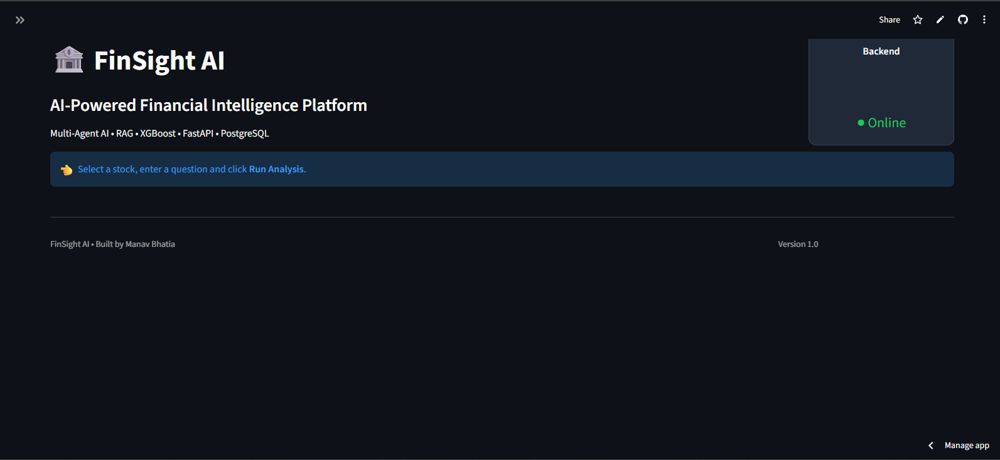
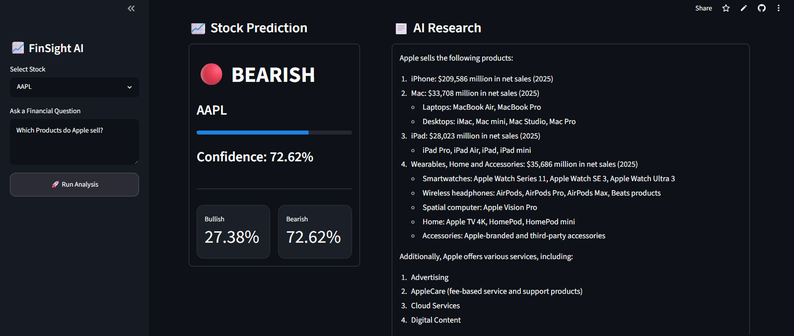
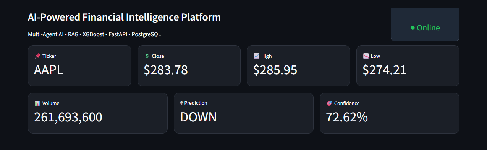
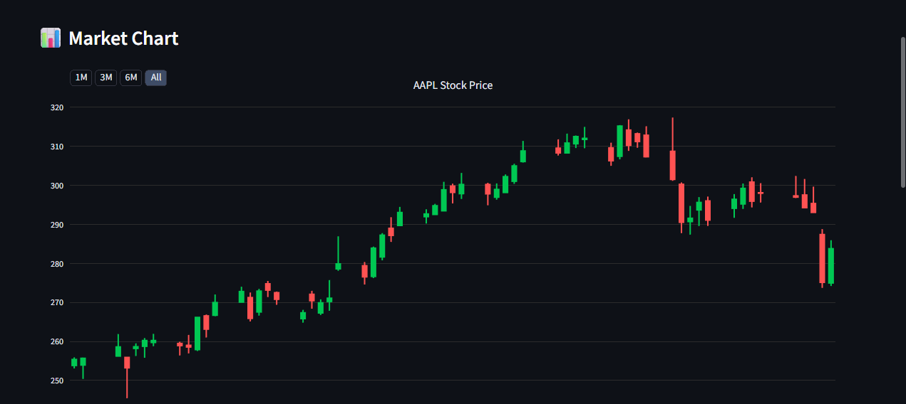
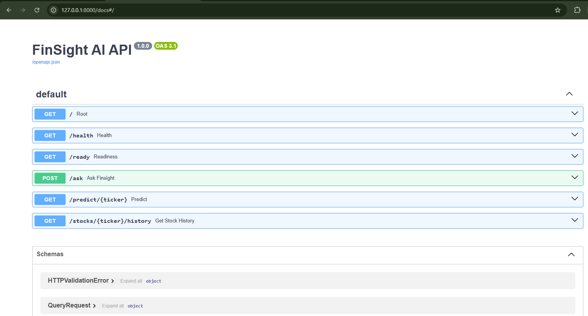

<div align="center">

# 📈 FinSight AI

### Multi-Agent Financial Intelligence Platform

*AI agents that research, predict, and reason about the market — grounded in real data.*

[](https://python.org)
[](https://fastapi.tiangolo.com)
[](https://streamlit.io)
[](https://langchain-ai.github.io/langgraph/)
[](https://xgboost.ai)
[](https://faiss.ai)
[](https://supabase.com)
[](https://docker.com)
[](https://github.com/features/actions)
[](LICENSE)

[**Live Demo**](https://finsight-ai-manav.streamlit.app/) · [**API Docs**](https://manav2204-finsight-ai-api.hf.space/docs) · [**Report Bug**](#) · [**Request Feature**](#)

</div>

---

FinSight AI is an end-to-end financial intelligence platform powered by five coordinated AI agents. It combines Retrieval-Augmented Generation over financial documents, XGBoost-based stock movement prediction, real-time macroeconomic data, and financial fundamentals/risk analysis — deployed as a live, cloud-hosted production system with CI/CD, automated testing, and observability, not a local notebook demo.

---

## 🚀 Live Demo

| | |
|---|---|
| 🌐 **Web App** | [finsight-ai-manav.streamlit.app](https://finsight-ai-manav.streamlit.app/) |
| ⚡ **API** | [manav2204-finsight-ai-api.hf.space](https://manav2204-finsight-ai-api.hf.space/) |
| 📚 **API Docs (Swagger)** | [manav2204-finsight-ai-api.hf.space/docs](https://manav2204-finsight-ai-api.hf.space/docs) |
| 📊 **Metrics** | [manav2204-finsight-ai-api.hf.space/metrics](https://manav2204-finsight-ai-api.hf.space/metrics) |

---

## 📸 Screenshots

<div align="center">

**Home Dashboard**


**AI Prediction & Financial Research**


**Market Intelligence Dashboard**


**Interactive Stock Charts**


**REST API Documentation**


</div>

---

## ✨ Project Highlights

- 🤖 **Multi-Agent Architecture** — Five specialized AI agents orchestrated with LangGraph
- 📚 **Retrieval-Augmented Generation** — Semantic search over financial documents using FAISS, validated by an automated evaluation suite
- 📈 **ML Stock Prediction** — XGBoost models trained on technical + macroeconomic features
- 💰 **Financial Intelligence** — Fundamentals, risk metrics (volatility, Sharpe ratio, beta, drawdown), and company comparison
- 🌍 **Macroeconomic Integration** — Live indicators from the FRED API feed directly into predictions and risk-free rate calculations
- ⚡ **Production REST API** — FastAPI backend with rate limiting, CORS, and full Swagger documentation
- 🔒 **API Security** — Rate limiting, scoped CORS, and sanitized error responses
- 🔁 **CI/CD Pipeline** — GitHub Actions runs 42+ automated tests and a Docker build check on every push
- 📊 **Observability** — Prometheus metrics for request latency, volume, and per-agent routing
- 🔄 **Automated Data Refresh** — Weekly scheduled pipeline keeps market data current
- 📊 **Interactive Dashboard** — Streamlit frontend with an in-app FAQ for first-time users
- ☁️ **Fully Cloud Deployed** — Live across three platforms, not just a local demo
- 🐳 **Containerized** — Reproducible local development with Docker Compose
- 🗄️ **Persistent Storage** — PostgreSQL on Supabase for market data and history

---

## 📊 Project Statistics

<div align="center">

| Metric | Value |
|:---|:---:|
| 🤖 AI Agents | 5 |
| 📈 ML Models | 7 (XGBoost) |
| 📄 Financial Documents | 5 |
| 📊 Supported Stocks | 7 |
| 🔍 Vector Database | FAISS (450 chunks) |
| ⚡ REST API Endpoints | 8 |
| ✅ Automated Tests | 42 |
| 🎯 RAG Eval Pass Rate | 100% (15/15) |
| 🗄️ Database | PostgreSQL (Supabase) |
| ☁️ Cloud Platforms | 3 |
| 🐳 Dockerized | ✅ |
| 🌐 Live Deployments | 2 |

</div>

---

## 🏗️ Architecture

FinSight AI follows a modular, agent-based architecture. A central orchestrator routes each user query to one or more specialized agents, which independently retrieve data, run models, or perform semantic search before their outputs are combined into a final response.

### AI Agents

| Agent | Responsibility | Technologies |
|---|---|---|
| 🧭 **Orchestrator Agent** | Determines which agent(s) should handle a given query, including off-topic detection | LangGraph |
| 📥 **Ingestion Agent** | Retrieves and prepares market data, documents, and macro indicators | yfinance, FRED API |
| 📚 **Research Agent** | Performs semantic search and generates grounded research via RAG | FAISS, Sentence Transformers, Groq LLM |
| 📈 **ML Prediction Agent** | Predicts next-day stock movement with confidence scoring | XGBoost, Scikit-learn |
| 💰 **Financial Intelligence Agent** | Fundamentals, risk metrics, and company comparison | yfinance, FRED, Pandas |

### System Flow

```
┌──────────┐     ┌────────────────┐     ┌──────────────┐
│   User   │────▶│  Streamlit UI  │────▶│  FastAPI API │
└──────────┘     └────────────────┘     └──────┬───────┘
                                                │
                                                ▼
                                    ┌───────────────────────┐
                                    │   Orchestrator Agent   │
                                    │       (LangGraph)      │
                                    └────────────┬────────────┘
                                                │
              ┌───────────┬───────────┬────────┼────────┬───────────┐
              ▼           ▼           ▼        ▼        ▼           ▼
        ┌──────────┐┌──────────┐┌──────────┐┌──────┐┌─────────┐┌──────────┐
        │Ingestion ││ Research ││Prediction││ Fin. ││Comparison││Off-Topic│
        │  Agent   ││  Agent   ││  Agent   ││Intel.││          ││ Handler │
        └────┬─────┘└────┬─────┘└────┬─────┘└──┬───┘└────┬────┘└─────────┘
             ▼           ▼           ▼          ▼         ▼
     yfinance/FRED   FAISS+Groq   XGBoost   yfinance   Fundamentals
                                            /FRED       + Risk
              │           │           │        │         │
              └───────────┴───────────┴────────┴─────────┘
                                     ▼
                          ┌───────────────────────┐
                          │  PostgreSQL (Supabase) │
                          └────────────┬────────────┘
                                     ▼
                               Final Response
                                     │
                                     ▼
                                   User
```

---

## 🔑 Features

### 🧠 Multi-Agent Financial Intelligence
Five specialized agents coordinate through LangGraph to reason, retrieve, predict, compare, and respond — rather than relying on a single LLM call to do everything. A dedicated router step detects off-topic queries and redirects politely instead of hallucinating an answer.

### 📚 Retrieval-Augmented Generation
The Research Agent grounds its answers in real financial documents using FAISS semantic search before generating a response, reducing hallucination and improving factual accuracy. Retrieval quality is measured with a fixed, repeatable evaluation suite — see [RAG Evaluation](#-rag-evaluation) below.

**Indexed document types:**
- SEC 10-K Reports (Apple, Microsoft, NVIDIA)
- Federal Reserve Monetary Policy Reports
- FOMC Meeting Minutes

### 💰 Financial Intelligence
A dedicated agent computes company fundamentals (P/E, P/B, ROE, ROA, margins, growth, CAGR), risk metrics (annualized volatility, maximum drawdown, Sharpe ratio using a live FRED risk-free rate, beta vs. S&P 500), and side-by-side company comparisons — all from live data, not cached snapshots.

### 📈 ML-Powered Stock Prediction
The ML Prediction Agent uses XGBoost classifiers trained on technical indicators and macroeconomic features to estimate next-day price movement, with a confidence score. Model integrity is verified by automated tests on every CI run.

**Supported tickers:** AAPL · MSFT · NVDA · AMZN · GOOGL · META · TSLA

### 🌍 Macroeconomic Awareness
Live indicators from the FRED API — CPI, interest rates, unemployment, GDP, inflation — feed directly into prediction feature engineering and risk-adjusted return calculations.

### 📊 Interactive Dashboard
The Streamlit frontend lets users select a company, explore historical candlestick charts and volume, view AI-generated predictions and research side by side, and download a PDF report. An in-app FAQ helps first-time visitors know what to ask.

### ⚡ Production REST API
A FastAPI backend exposes every capability as documented, testable, rate-limited REST endpoints via Swagger — with scoped CORS and sanitized error responses so internal details never leak to callers.

### 🔁 Continuous Integration
Every push to `main` runs 42 automated tests (model integrity, orchestrator routing, financial calculations, database health) followed by a Docker build check — nothing merges without passing.

### 📊 Observability
Prometheus metrics track request volume, latency, and — via a custom counter — exactly which agent handled each query, giving real visibility into how the multi-agent system is actually used.

---

## 🛠️ Tech Stack

| Category | Technologies |
|---|---|
| **Language** | Python 3.12, SQL |
| **AI / Orchestration** | LangGraph, LangChain, Groq LLM, RAG |
| **Machine Learning** | XGBoost, Scikit-learn, Pandas, NumPy |
| **Vector Search** | FAISS, Sentence Transformers, Hugging Face Embeddings |
| **Backend** | FastAPI, SQLAlchemy, Pydantic, Uvicorn, SlowAPI |
| **Frontend** | Streamlit, Plotly |
| **Database** | PostgreSQL (Supabase) |
| **Financial Data** | Yahoo Finance, FRED API |
| **Testing** | Pytest (42 tests) |
| **CI/CD** | GitHub Actions |
| **Observability** | Prometheus (prometheus-fastapi-instrumentator) |
| **Deployment** | Docker, Docker Compose, Git LFS |
| **Cloud** | Streamlit Community Cloud, Hugging Face Spaces, Supabase |

---

## 📁 Project Structure

```
finsight-ai
│
├── agents/
│   ├── orchestrator_agent/
│   ├── ingestion_agent/
│   ├── research_agent/
│   ├── ml_prediction_agent/
│   └── financial_intelligence_agent/
│
├── api/
│   ├── database/
│   ├── models/
│   ├── tests/
│   └── main.py
│
├── rag/
│   ├── ingestion/
│   ├── embeddings/
│   ├── vectorstore/
│   ├── retrieval/
│   ├── evaluation/
│   └── qa/
│
├── ui/
├── scripts/
├── config/
├── data/
│   ├── raw/
│   └── processed/
├── tests/
├── assets/
│   └── screenshots/
│
├── .github/workflows/       # CI pipeline + scheduled data refresh
├── docker-compose.yml
├── Dockerfile
├── requirements.txt
├── startup.py
├── README.md
└── LICENSE
```

| Folder | Purpose |
|---|---|
| `agents/` | The five specialized AI agents |
| `api/` | FastAPI backend, REST endpoints, database models, tests |
| `rag/` | RAG pipeline — ingestion, embeddings, FAISS indexing, retrieval, evaluation |
| `ui/` | Streamlit dashboard |
| `.github/workflows/` | CI pipeline and weekly automated data refresh |

---

## 🔄 AI Workflow

This shows how a single user request is processed, from query to final response.

```
 User submits a question
          │
          ▼
   FastAPI receives request
          │
          ▼
  Orchestrator Agent (LangGraph)
   evaluates query intent
          │
          ├───────┬───────┬────────┬─────────┬─────────┐
          ▼       ▼       ▼        ▼         ▼         ▼
      Research Predict  Fin.   Risk    Compare   Off-topic
                        Intel                     redirect
          │       │       │        │         │         │
          └───────┴───────┴────────┴─────────┴─────────┘
                          ▼
                 Combined response
                    assembled
                          │
                          ▼
                  Returned to user
                  via API / Dashboard
```

**Example routing:**

| Query Type | Example | Route |
|---|---|---|
| Research only | *"What did the Fed say about rate cuts?"* | Research Agent |
| Prediction only | *"Will TSLA go up tomorrow?"* | ML Prediction Agent |
| Fundamentals | *"What is Apple's P/E ratio?"* | Financial Intelligence Agent |
| Risk | *"What is Tesla's volatility?"* | Financial Intelligence Agent |
| Comparison | *"Compare Apple and Microsoft"* | Financial Intelligence Agent |
| Off-topic | *"What's the capital of France?"* | Graceful redirect |
| Combined | *"Should I invest in Apple based on current conditions?"* | Research + ML Prediction |

---

## ⚙️ Installation

### Clone the repository

```bash
git clone https://github.com/manavbhatia2204/finsight-ai.git
cd finsight-ai
```

### Create a virtual environment

```bash
python -m venv venv
```

**Windows**
```bash
venv\Scripts\activate
```

**Linux / macOS**
```bash
source venv/bin/activate
```

### Install dependencies

```bash
pip install -r requirements.txt
```

### Configure environment variables

Create a `.env` file in the project root:

```env
DB_USER=
DB_PASSWORD=
DB_HOST=
DB_PORT=
DB_NAME=

GROQ_API_KEY=
FRED_API_KEY=

GROQ_MODEL=
FASTAPI_URL=
```

### Run locally

```bash
# Start all services with Docker
docker compose up --build
```

```bash
# Or run the dashboard directly
streamlit run ui/app.py
```

Once running:
- Dashboard → `http://localhost:8501`
- API → `http://localhost:8000`
- Swagger Docs → `http://localhost:8000/docs`
- Metrics → `http://localhost:8000/metrics`

### Run the test suite

```bash
python -m pytest agents/ml_prediction_agent/tests/test_model_integrity.py agents/orchestrator_agent/tests/test_routing.py agents/financial_intelligence_agent/tests/test_financial_intelligence.py api/tests/test_database.py -v
```

---

## ☁️ Deployment

FinSight AI is fully deployed to production across three cloud platforms — this isn't just a local demo.

```
        User
         │
         ▼
Streamlit Community Cloud   (Frontend)
         │
         ▼
FastAPI on Hugging Face Spaces   (Backend)
         │
         ▼
Supabase PostgreSQL   (Database)
```

| Layer | Platform | Notes |
|---|---|---|
| Frontend | Streamlit Community Cloud | Live dashboard, auto-deployed from `main` |
| Backend | Hugging Face Spaces | FastAPI REST API + Swagger docs |
| Database | Supabase | Managed PostgreSQL, weekly automated refresh via GitHub Actions |
| Local Dev | Docker Compose | Full stack runs locally for development |
| Large Files | Git LFS | Tracks XGBoost models (`.pkl`), FAISS indexes, and PDFs |
| CI/CD | GitHub Actions | Test suite + Docker build check on every push to `main` |

### REST API Endpoints

| Method | Endpoint | Description |
|---|---|---|
| `GET` | `/` | API status |
| `GET` | `/health` | Health check |
| `GET` | `/ready` | Readiness check |
| `GET` | `/metrics` | Prometheus metrics |
| `POST` | `/ask` | Query the multi-agent system (rate limited) |
| `GET` | `/predict/{ticker}` | Predict next-day stock movement (rate limited) |
| `GET` | `/stocks/{ticker}/history` | Retrieve historical stock prices |
| `GET` | `/stocks/{ticker}/live` | Fetch current live price (rate limited) |

Full interactive documentation is available via [Swagger UI](https://manav2204-finsight-ai-api.hf.space/docs).

---

## 🎯 RAG Evaluation

FinSight AI includes a repeatable evaluation framework that measures retrieval quality against a fixed set of 15 test questions spanning all indexed documents.

**Methodology:**
- Each question checks two things: whether retrieval pulls from the correct source document, and whether the retrieved content contains the expected keywords for a genuinely correct answer
- The evaluation dataset is fixed — not regenerated per run — so results are comparable over time and catch regressions

**Latest results:**

| Metric | Score |
|---|---|
| Pass rate | 15/15 (100%) |
| Avg keyword coverage | 94.5% |
| Source match rate | 100% |

**Run it yourself:**
```bash
python -m rag.evaluation.run_eval
```

**A real bug this framework caught:** the evaluation initially returned a 26.7% pass rate — every non-Apple question was silently retrieving Apple 10-K content regardless of what was asked. Investigation traced this to the vector store being built before all 5 source documents existed in the ingestion folder, meaning 4 of 5 documents were never indexed despite being present in the repo. Rebuilding the index after the fix raised the pass rate to 100%.

---

## 🔒 Security

- **Rate limiting** — `/ask`, `/predict/{ticker}`, and `/stocks/{ticker}/live` are rate-limited per IP via SlowAPI to prevent cost abuse on LLM and compute-intensive endpoints, while remaining publicly usable
- **Scoped CORS** — explicit allow-list rather than a wildcard origin
- **Sanitized errors** — internal exception details are logged server-side but never returned to API callers
- **Secret management** — credentials live in environment variables and GitHub Secrets, never committed to source control

---

## 🧪 Testing & CI/CD

FinSight AI has 42 automated tests covering the areas most likely to break silently in production:

| Suite | What it verifies |
|---|---|
| Model integrity | All 7 XGBoost models load correctly and produce valid predictions |
| Orchestrator routing | Queries route to the correct agent based on intent |
| Financial Intelligence | Fundamentals and risk metrics return valid, sane data |
| Database health | Connection is live and price data isn't stale |

Every push to `main` triggers a GitHub Actions pipeline: tests run first, and a Docker build is only attempted if all tests pass. A weekly scheduled workflow also refreshes market data automatically, keeping the database from silently going stale.

---

## 📊 Observability

Prometheus metrics are exposed at `/metrics`, including standard HTTP request/latency histograms plus a custom `finsight_agent_route_total` counter tracking how many requests each of the five agents has handled — real visibility into system usage, not just uptime.

### Deployment Engineering Note

Getting a multi-service AI system (agents, ML models, vector index, database) running reliably across three separate free-tier cloud platforms required solving binary asset management with Git LFS, working around memory constraints during deployment, and diagnosing several real production issues along the way — including a stale data pipeline, corrupted model files from a library version mismatch, and an incomplete RAG index — each caught and fixed through systematic testing rather than manual spot-checking.

---

## 🗺️ Roadmap

FinSight AI v2 is complete: Financial Intelligence Agent, API security, CI/CD, RAG evaluation, observability, and UX polish. Ideas for future work:

- [ ] Kubernetes orchestration
- [ ] Model registry and automated retraining
- [ ] Expanded document repository with automated ingestion
- [ ] Support for additional companies
- [ ] Multi-step agent planning
- [ ] Explainable AI for predictions
- [ ] Experiment tracking

---

## 👤 About Me

**Manav Bhatia**

AI Engineer based in Dublin, Ireland, holds an M.Sc. in Computing (Artificial Intelligence) from Dublin City University. Previously worked as an AI/ML Engineer at Iris Business Service Limited.

FinSight AI was built as an end-to-end, self-directed project to demonstrate practical experience across multi-agent systems, RAG pipelines, machine learning, and production deployment — including security hardening, CI/CD, automated testing, and observability.

[](https://github.com/manavbhatia2204)
[](https://linkedin.com/in/manav-bhatia-569995267)

---

⭐ If you found this project interesting, consider giving the repository a star.

---

## 📄 License

This project is licensed under the MIT License — see the [LICENSE](LICENSE) file for details.
